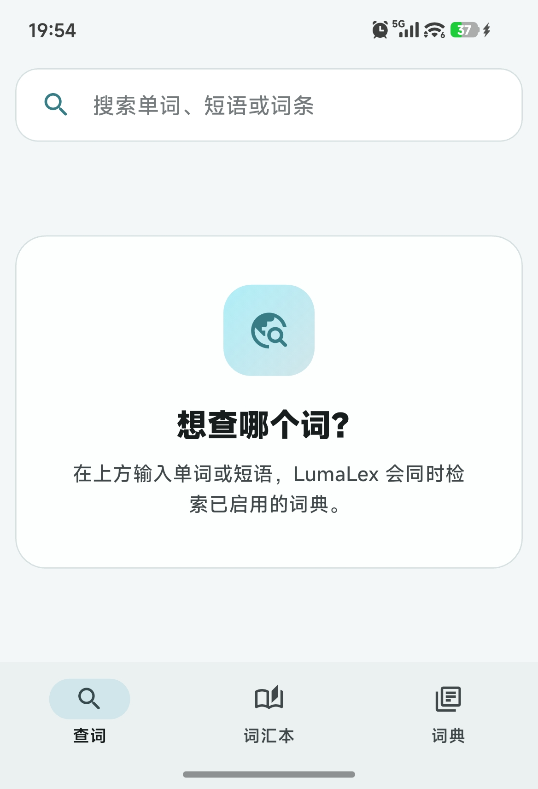
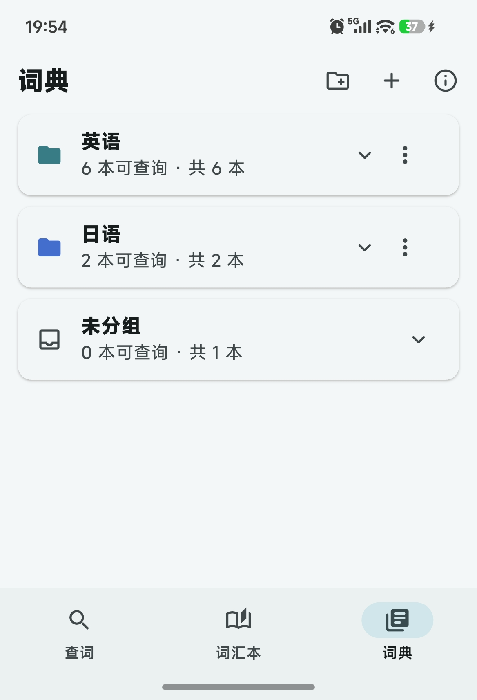
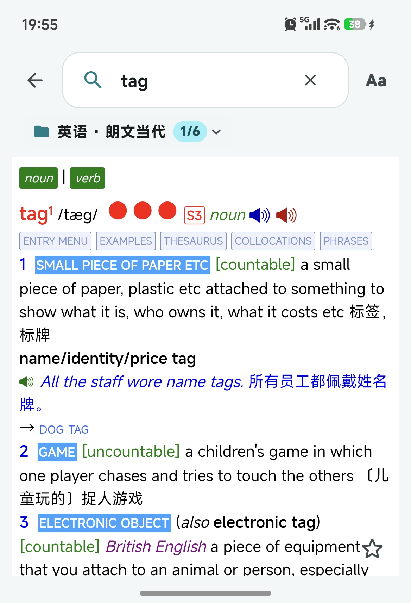
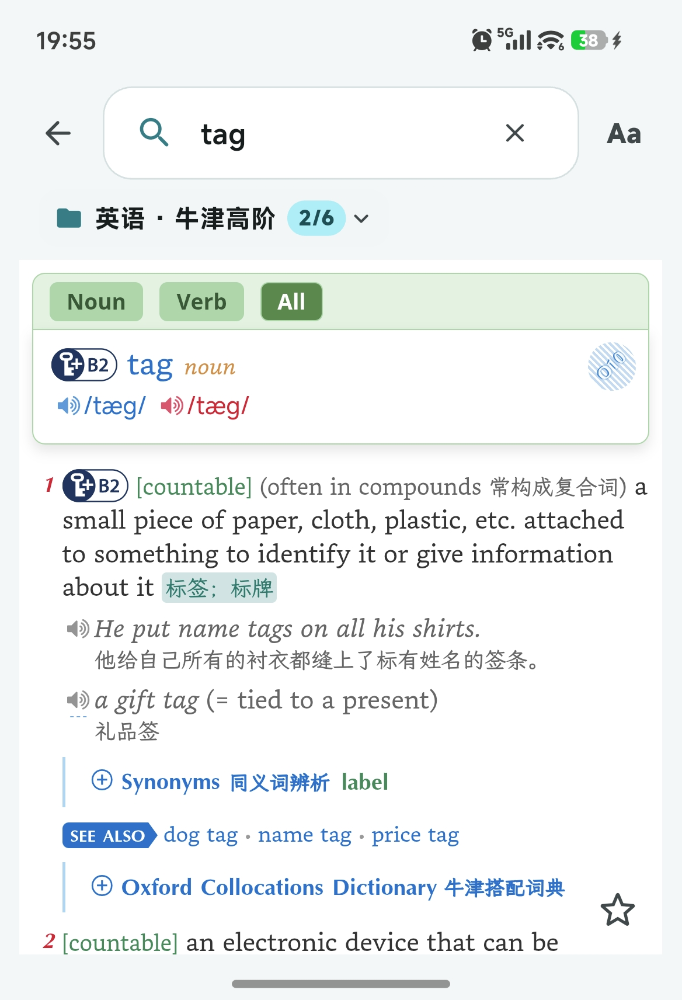
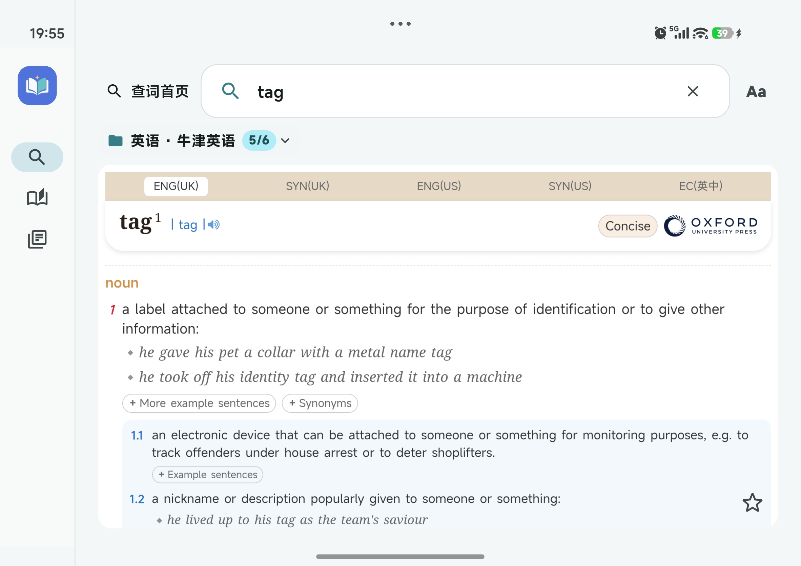
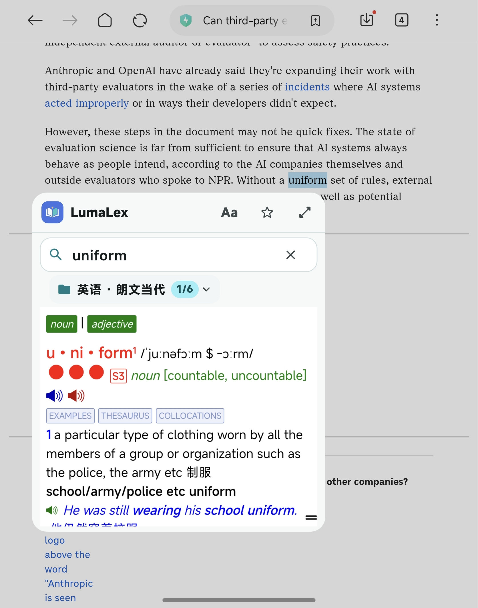
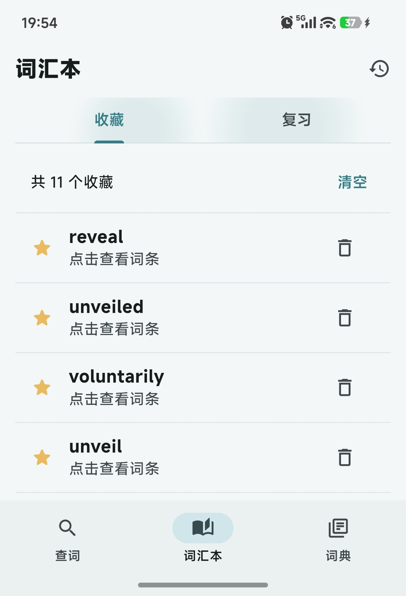
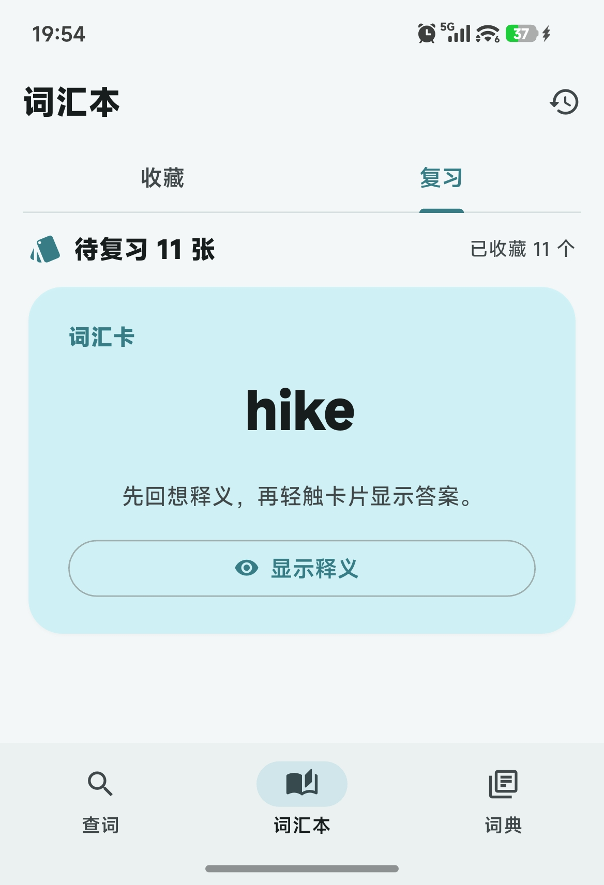

# LumaLex Android 使用说明

[简体中文](USER_GUIDE.zh-CN.md) | [English](USER_GUIDE.en.md) · [返回介绍](../README.md)

适用于 Android `0.1.0 build 48`。iOS / iPadOS 仍在开发中，本文不提供其安装或操作步骤。

## 1. 下载与安装

从 [Android Release](https://github.com/memetics1980/lumalex-mobile/releases/tag/v0.1.0-build48-android) 的 **Assets** 下载 `LumaLex-0.1.0-build48-arm64-v8a.apk`。本包适用于 **Android 7.0（API 24）及以上的 ARM64 设备**，不包含 32 位 ARM 或 x86 版本。

在手机上打开 APK，按系统提示允许当前浏览器或文件管理器“安装未知应用”，再完成安装。不同厂商的提示名称可能不同。GitHub 提供的 Source code ZIP/TAR 是源码，不可直接安装。

已有同一正式签名的版本时可尝试覆盖安装；如提示签名不一致，不要先卸载丢失记录，先在旧版导出学习数据并确认安装包来源。应用标识为 `com.lumalex.dictionary`。

如需核验下载完整性，Release 同时提供 SHA-256 文件。在电脑上把 APK 和 `.apk.sha256` 放在同一文件夹，执行：

```sh
shasum -a 256 -c LumaLex-0.1.0-build48-arm64-v8a.apk.sha256
```

## 2. 准备与导入词典

LumaLex 不附带词典数据。请准备有权使用的 MDX/MDD 文件，先解压压缩包，并保持完整的文件结构。例如：

```text
MyDictionaries/
  Example/
    Example.mdx
    Example.mdd
    Example.1.mdd
    Example.2.mdd
```

`.mdx` 存放词条，`.mdd` 存放配套资源；有些词典只有 MDX。配套资源卷需保留原名称并与 MDX 放在一起，词典随附的 CSS、JavaScript、字体等文件也应保留原来的位置。

1. 打开底部“词典”页；宽屏布局从侧边导航进入。
2. 点“导入词典”的添加按钮。
3. 在 Android 系统文件夹选择器中选中词典所在文件夹，并允许 LumaLex 读取。
4. 等待扫描与导入。应用可查找所选文件夹及子文件夹中的 MDX，并配对相应资源卷。
5. 检查词典是否启用，再回到“查词”查询。

Android 会为 MDX 建立应用私有的读取副本，以改善随机读取性能；大型 MDD 留在原位置按需读取。原文件不会被修改。导入前应预留额外的 MDX 存储空间，不要导入后删除或移动原文件夹，尤其是 MDD 和配套文件。

索引会在后台准备；新导入的大词典可能需要更长时间。部分系统限制对存储根目录或受保护目录的授权，可将词典放入普通的专用子文件夹后重新选择。


<a href="images/android-home.jpg"></a>

## 3. 分组、启用与顺序

在“词典”页可新建分组，展开组内词典，并通过分组或词典旁的更多操作管理名称、颜色、顺序与归属。启用状态决定词典是否参与查询。

<a href="images/android-dictionary-groups.jpg"></a>

分组标题同时显示“可查询”和“总数”；禁用或暂时无法访问的记录可能仍计入总数。“未分组”用于未指定分组的词典。创建或删除分组、修改显示名称不会移动或重命名原始 MDX/MDD；从词典库移除的是应用中的记录，不是原文件。

## 4. 查词与切换词典

1. 在“查词”页输入单词或短语，提交查询，也可选择前缀建议。
2. 点词典名称打开列表，选择“全部词典”、某个分组或“未分组”等查找范围。
3. 在词条正文**向左滑到下一本有结果的词典，向右滑到上一本**。也可点上方词典名称直接选择。
4. 看名称旁的 `1/6` 等计数，确认当前结果位置。手势只在当前范围中有结果的词典之间切换。

<a href="images/android-main-lookup.jpg"></a>
<a href="images/android-dictionary-switch.jpg"></a>

请从正文中部用单指作明显的横向滑动。上下滑动用于滚动；屏幕边缘起始和多指操作不会触发词典切换，以减少与系统返回手势等操作的冲突。在词典自身的横向交互控件上操作时，可改用名称列表选择词典。

点词条内的关联词可继续查词；正文文字双击也可触发本地查词，链接、发音和词典按钮等交互区域会被排除。若没有精确结果，应用会尝试常见词形和有限的拼写建议，仍可能需要手动调整查询。

### 字号与发音

点右上角 `Aa` 展开字号控制，使用 `− / +` 调整阅读大小。字号会保存，浮窗与主界面共用这份设置。

点词典自身的喇叭或发音按钮播放音频。能否播放取决于匹配的 MDD 是否可读、词典是否提供音频；使用系统朗读的控件还取决于手机的语音引擎与相应语言资源。若需要完全离线的系统朗读，请先安装离线语音资源。

### 横屏与宽屏

宽屏会使用侧边导航，给词条更多阅读空间。可根据设备能力使用横屏或系统分屏；正文手势和词典名称列表的用法相同。

[](images/android-wide-reader.jpg)

## 5. 在其他应用中选词查词

先打开 LumaLex 并导入、启用词典，然后：

1. 在浏览器或阅读器中长按并选中单词或短语。
2. 查看 Android 的文字操作菜单；如有“更多”或溢出菜单，也检查其中的项目。
3. 点 **“LumaLex 查词”**，在原应用上方打开查词浮窗。

<a href="images/android-selected-text-lookup.jpg"></a>

浮窗操作：

| 操作 | 方法 |
| --- | --- |
| 更换查询 | 在浮窗搜索框输入新的词 |
| 切换词典 | 正文左右滑动，或点词典名称 |
| 调整字号 | 点顶部 `Aa`，再调整字号 |
| 收藏 | 点顶部星形按钮 |
| 移动 | 拖动顶部标题的空白区域 |
| 调整大小 | 拖动右下角的尺寸控制 |
| 最大化 / 恢复 | 点顶部斜箭头按钮 |
| 返回阅读 | 点窗口外关闭浮窗 |

浮窗与主界面共享历史、收藏、复习记录和字号；返回主界面时会刷新。该入口使用系统 `PROCESS_TEXT`，无需另行开启“在其他应用上层显示”权限。

部分应用使用自己的选择菜单，不提供此入口。扫描 PDF 或图片没有可选择文字时也无法使用；它不是 OCR，不会保证读取所有应用。可复制单词后回到 LumaLex 手动查词。

## 6. 收藏、历史与复习

点词条页的星形按钮收藏或取消收藏。进入“词汇本 → 收藏”，点单词即可重新查词。通过历史图标或“管理历史”查看、查找并管理以前的查询。

<a href="images/android-favorites.jpg"></a>

进入“词汇本 → 复习”，先回想词义，再点“显示释义”。答案来自本地词典；词典不可用时应先恢复词典访问。显示答案后选择：

| 选项 | 含义 |
| --- | --- |
| 再来一次 | 暂时记不起，需要很快再看 |
| 有点模糊 | 记忆不清晰 |
| 认识 | 能正常回想 |
| 很熟 | 回想容易 |

应用按评价安排下一次复习，实际间隔显示在按钮旁。历史和收藏支持单条删除、批量选择及清空；清空前有确认。删除收藏会影响对应的复习卡片。

<a href="images/android-review.jpg"></a>

## 7. 备份、恢复与诊断

进入“词典 → 关于与诊断”：

- **导出学习数据**：保存 JSON，包含历史、收藏、复习进度和字号。
- **恢复学习数据**：选择之前导出的 JSON，确认后**替换当前学习记录**，不是合并；恢复前可先导出当前记录。
- **保存诊断报告**：生成本地报告，用于检查版本、运行环境和阅读器事件。

学习数据备份不包含词典文件、词典库结构或文件夹授权；换机后仍需准备并重新导入词典。手机与桌面版不会自动同步。卸载会删除应用私有数据，应先导出需要保留的学习记录。分享诊断报告前可查看其内容。

## 8. 常见问题

| 问题 | 检查方法 |
| --- | --- |
| APK 无法安装 | 确认 Android 7.0+、ARM64、存储空间和安装来源权限；覆盖安装还需签名一致 |
| 导入后没有可查词典 | 确认压缩包已解压、文件是 MDX、系统已授予文件夹读取权限且词典已启用 |
| 某本词典没有查询结果 | 检查当前范围、启用状态、拼写及该词典是否实际收录该词 |
| 图片、字体或声音缺失 | 检查同名及编号 MDD、配套文件、原文件夹是否仍可读 |
| 左右滑动没有切换 | 从正文中部单指横滑，确认范围内还有其他有结果的词典；可点名称直接选择 |
| 取词菜单没有 LumaLex | 来源应用可能不支持标准文字操作菜单；检查“更多”，或回到主界面输入 |
| 大词典首次查询较慢 | 留出索引准备时间；确认存储空间充足，必要时减少启用的词典范围 |
| 重新打开后词典不可访问 | 原目录可能移动或授权失效；恢复原目录或重新导入取得读取权限 |
| 更新后显示异常 | 到“关于与诊断”核对版本，保存诊断报告，并检查源词典资源是否完整 |

本版本主要提供本地 MDX/MDD 查词、取词浮窗和词汇学习。桌面版的全局快捷键与 AI 语境释义不属于此 Android 版本的使用步骤。
